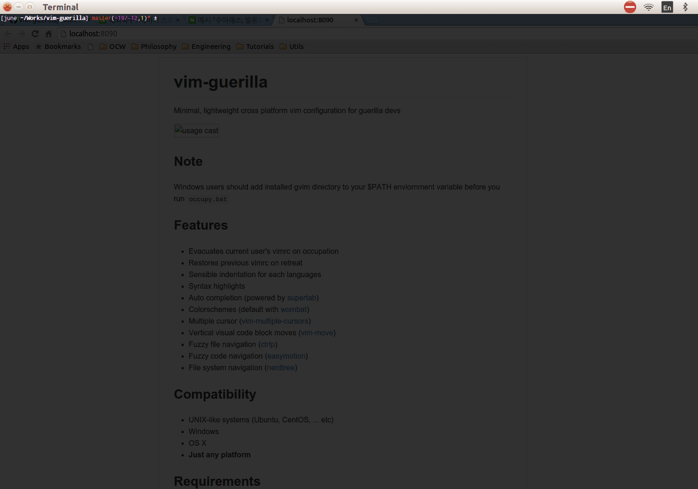

# vim-guerilla
Minimal, lightweight cross platform vim configuration for guerilla devs

## Author
[Ha Junsoo](https://github.com/kuc2477)

## Rationale
Although vim has one of the most richest plugin ecosystem by itself,
some of them requires vim extensions (python, lua, etc) and it sucks
when it comes to a situation where we need them on non-root privileged
local machines with vanilla vim. **`vim-guerilla` is a sensible vim
configuration with a handful of plugins that doesn't require any
vim extensions at all.**

`vim-guerilla` will create a backup of previous vim configurations on
occupation and restore it when you retreat.

## TL;DR
`vim-guerilla` solves following 2 problems
- Need for a lightweight, cross platform vim configuration with easy installation
- Tedious work to create backup of previous configurations before installing one's own vimrc

## Usage

## Occupy
`occupy.[sh|bat]` (*windows users should add gvim directory to
                    your `PATH` before occupation*)

## Retreat
`retreat.[sh|bat]`

## Features
- Evacuate current user's vimrc on occupation
- Restore previous vimrc on retreat
- Sensible indentation for each languages
- Syntax highlights
- Auto completion (powered by [supertab])
- Colorschemes (default with [wombat])
- Multiple cursor ([vim-multiple-cursors])
- Vertical visual code block moves ([vim-move])
- Fuzzy file navigation ([ctrlp])
- Fuzzy code navigation ([easymotion])
- File system navigation ([nerdtree])

## Compatibility
- UNIX-like systems (Ubuntu, CentOS, ... etc)
- Windows
- OS X
- **Just any platform**

## Requirements
- no root privilege required
- no vim extensions required
- **Just vim (gvim) and git on your platform**

## Customization
- Fully documented
- Feel free to customize configurations as you want!

[wombat]: https://github.com/dsolstad/vim-wombat256i
[supertab]: https://github.com/ervandew/supertab
[ctrlp]: https://github.com/kien/ctrlp.vim
[easymotion]: https://github.com/easymotion/vim-easymotion
[nerdtree]: https://github.com/scrooloose/nerdtree
[vim-move]: https://github.com/kuc2477/vim-move
[vim-multiple-cursors]: https://github.com/terryma/vim-multiple-cursors
